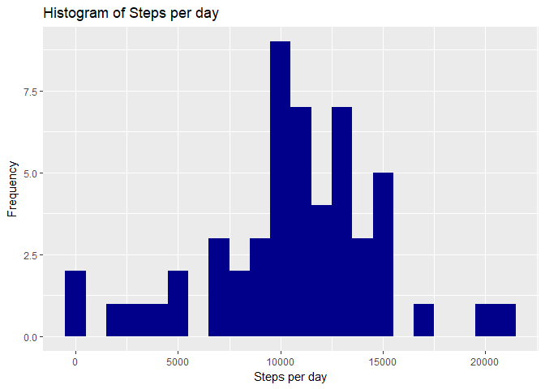
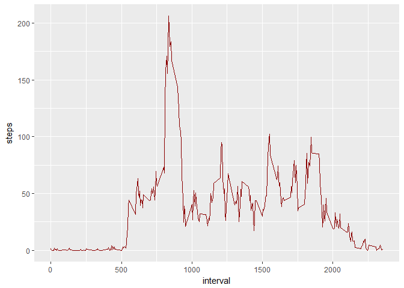
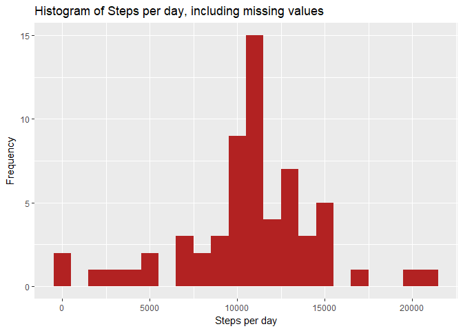
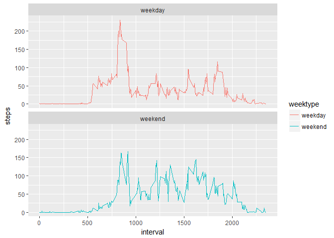

# Project Assignment 1
Craig Clissold  
July 21, 2018  

## Introduction

It is now possible to collect a large amount of data about personal movement using activity monitoring devices such as a [Fitbit](http://www.fitbit.com/), [Nike Fuelband](http://www.nike.com/us/en_us/c/nikeplus-fuelband), or [Jawbone Up](https://jawbone.com/up). These type of devices are part of the "quantified self" movement - a group of enthusiasts who take measurements about themselves regularly to improve their health, to find patterns in their behavior, or because they are tech geeks. But these data remain under-utilized both because the raw data are hard to obtain and there is a lack of statistical methods and software for processing and interpreting the data.


This assignment makes use of data from a personal activity monitoring device. This device collects data at 5 minute intervals through out the day. The data consists of two months of data from an anonymous individual collected during the months of October and November, 2012 and include the number of steps taken in 5 minute intervals each day.

The data for this assignment can be downloaded from the course web site:
        - Dataset:[Activity monitoring data](https://d396qusza40orc.cloudfront.net/repdata%2Fdata%2Factivity.zip)

The variables included in this dataset are:

1. **steps:** Number of steps taking in a 5-minute interval (missing values are coded as NA)
        
2. **date:** The date on which the measurement was taken in YYYY-MM-DD format
        
3. **interval:** Identifier for the 5-minute interval in which measurement was taken
        
The dataset is stored in a comma-separated-value (CSV) file and there are a total of 17,568 observations in this dataset.

## R Coding Prep
### Loading Packages and Setting Global Paramaters

Dependent packages are loaded with the default of echo to set to TRUE throughout the document


```r
library(knitr)
opts_chunk$set(echo = TRUE)
library(dplyr)
library(lubridate)
library(ggplot2)
```

## Get and Clean the Data

Find the activity.csv file from the introduction above, unzip and save in your working directory.
Transfor the column formats:


```r
data <- read.csv("activity.csv", header = TRUE, sep = ',', colClasses = c("numeric", "character",                      "integer"))
```

Format the date field and check the structure results:


```r
data$date <- ymd(data$date)
str(data)
```

```
## 'data.frame':	17568 obs. of  3 variables:
##  $ steps   : num  NA NA NA NA NA NA NA NA NA NA ...
##  $ date    : Date, format: "2012-10-01" "2012-10-01" ...
##  $ interval: int  0 5 10 15 20 25 30 35 40 45 ...
```

```r
head(data)
```

```
##   steps       date interval
## 1    NA 2012-10-01        0
## 2    NA 2012-10-01        5
## 3    NA 2012-10-01       10
## 4    NA 2012-10-01       15
## 5    NA 2012-10-01       20
## 6    NA 2012-10-01       25
```
Data cleansing is now complete.

# What is mean total number of steps taken per day?

For this part of the assignment missing values can be ignored.

1. Calculate the total number of steps taken per day.


```r
steps <- data %>%
  filter(!is.na(steps)) %>%
  group_by(date) %>%
  summarize(steps = sum(steps)) %>%
  print
```

```
## # A tibble: 53 x 2
##    date       steps
##    <date>     <dbl>
##  1 2012-10-02   126
##  2 2012-10-03 11352
##  3 2012-10-04 12116
##  4 2012-10-05 13294
##  5 2012-10-06 15420
##  6 2012-10-07 11015
##  7 2012-10-09 12811
##  8 2012-10-10  9900
##  9 2012-10-11 10304
## 10 2012-10-12 17382
## # ... with 43 more rows
```

2. Make a histogram of the total number of steps taken each day.


```r
ggplot(steps, aes(x = steps)) +
  geom_histogram(fill = "dark blue", binwidth = 1000) +
  labs(title = "Histogram of Steps per day", x = "Steps per day", y = "Frequency")
```

<!-- -->


3. Calculate and report the mean and median of the total number of steps taken per day.


```r
mean_steps <- mean(steps$steps, na.rm = TRUE)
median_steps <- median(steps$steps, na.rm = TRUE)
```

Mean Steps =

```
## [1] 10766.19
```
Median Steps = 

```
## [1] 10765
```
# What is the average daily activity pattern?

1. Make a time series plot (i.e. type = "l") of the 5-minute interval (x-axis) and the average number of steps taken, averaged across all days (y-axis)

- Calculate the average number of steps taken in each 5-minute interval per day and gfroup by interval:


```r
interval <- data %>%
  filter(!is.na(steps)) %>%
  group_by(interval) %>%
  summarize(steps = mean(steps))
```
- make a time series of the 5-minute interval and average steps taken:


```r
ggplot(interval, aes(x=interval, y=steps)) +
  geom_line(color = "dark red")
```

<!-- -->


2. Which 5-minute interval, on average across all the days in the dataset, contains the maximum number of steps?

- find out the maximum steps, on average, across all the days:


```r
interval[which.max(interval$steps),]
```

```
## # A tibble: 1 x 2
##   interval steps
##      <int> <dbl>
## 1      835  206.
```

The interval 835 has on average the highest count of steps with 206 steps.

# Imputing missing values

Note that there are a number of days/intervals where there are missing values (coded as $\color{red}{\text{NA}}$). The presence of missing days may introduce bias into some calculations or summaries of the data.

1. Calculate and report the total number of missing values in the dataset (i.e. the total number of rows with (coded as $\color{red}{\text{NAs}}$)

```r
sum(is.na(data$steps))
```
Missing Values are:

```
## [1] 2304
```
2. Devise a strategy for filling in all of the missing values in the dataset. The strategy does not need to be sophisticated. For example, you could use the mean/median for that day, or the mean for that 5-minute interval,etc.
3. Create a new dataset that is equal to the original dataset but with the missing data filled in.
4. Make a histogram of the total number of steps taken each day and Calculate and report the **mean** and **median** total number of steps taken per day. Do these values differ from the estimates from the first part of the assignment? What is the impact of imputing missing data on the estimates of the total daily number of steps?

- For this I will use the average number of steps in the same 5-min interval.
        
- Create a new dataset as the original and tapply for filling in the missing values with the average number of steps per 5 minute interval:

```r
data_full <- data
nas <- is.na(data_full$steps)
avg_interval <- tapply(data_full$steps, data_full$interval, mean, na.rm=TRUE, simplify=TRUE)
data_full$steps[nas] <- avg_interval[as.character(data_full$interval[nas])]
```
- Check there are no more missing values:

```r
sum(is.na(data_full$steps))
```

```
## [1] 0
```
- Calculate the number of steps taken in each 5-minute interval per day using dplyr and group by interval. Use ggplot for making the histogram:

```r
steps_full <- data_full %>%
  filter(!is.na(steps)) %>%
  group_by(date) %>%
  summarize(steps = sum(steps)) %>%
  print
```

```
## # A tibble: 61 x 2
##    date        steps
##    <date>      <dbl>
##  1 2012-10-01 10766.
##  2 2012-10-02   126 
##  3 2012-10-03 11352 
##  4 2012-10-04 12116 
##  5 2012-10-05 13294 
##  6 2012-10-06 15420 
##  7 2012-10-07 11015 
##  8 2012-10-08 10766.
##  9 2012-10-09 12811 
## 10 2012-10-10  9900 
## # ... with 51 more rows
```

```r
ggplot(steps_full, aes(x = steps)) +
  geom_histogram(fill = "firebrick", binwidth = 1000) +
  labs(title = "Histogram of Steps per day, including missing values", x = "Steps per day", y = "Frequency")
```

<!-- -->
- Calculate the mean and median steps with the filled in values:

```r
mean_steps_full <- mean(steps_full$steps, na.rm = TRUE)
median_steps_full <- median(steps_full$steps, na.rm = TRUE)
```
Mean Steps =

```
## [1] 10766.19
```
Median Steps = 

```
## [1] 10766.19
```
The impact of imputing missing data with the average number of steps in the same 5-min interval is that both the mean and the median are equal to the same value: 10766.

# Are there differences in activity patterns between weekdays and weekends?

1. Create a new factor variable in the dataset with two levels  "weekday" and "weekend" indicating whether a given date is a weekday or weekend day.
2. Make a panel plot containing a time series plot (i.e. 
(coded as $\color{red}{\text{type = "l"}}$)) of the 5-minute interval (x-axis) and the average number of steps taken, averaged across all weekday days or weekend days (y-axis). See the README file in the GitHub repository to see an example of what this plot should look like using simulated data.
- Using dplyr and mutate to create a new column, weektype, and apply whether the day is weekend or weekday:

```r
data_full <- mutate(data_full, weektype = ifelse(weekdays(data_full$date) == "Saturday" | weekdays(data_full$date) == "Sunday", "weekend", "weekday"))
data_full$weektype <- as.factor(data_full$weektype)
head(data_full)
```

```
##       steps       date interval weektype
## 1 1.7169811 2012-10-01        0  weekday
## 2 0.3396226 2012-10-01        5  weekday
## 3 0.1320755 2012-10-01       10  weekday
## 4 0.1509434 2012-10-01       15  weekday
## 5 0.0754717 2012-10-01       20  weekday
## 6 2.0943396 2012-10-01       25  weekday
```
- Calculating the average steps in the 5-minute interval and use ggplot for making the time series of the 5-minute interval for weekday and weekend, and compare the average steps:

```r
interval_full <- data_full %>%
  group_by(interval, weektype) %>%
  summarise(steps = mean(steps))
s <- ggplot(interval_full, aes(x=interval, y=steps, color = weektype)) +
  geom_line() +
  facet_wrap(~weektype, ncol = 1, nrow=2)
print(s)
```

<!-- -->

From the two plots it seems that the test object is more active earlier in the day during weekdays compared to weekends, but more active throughout the weekends compared with weekdays (the assumption would be the subject is working during the weekdays, hence moving less during the day).

